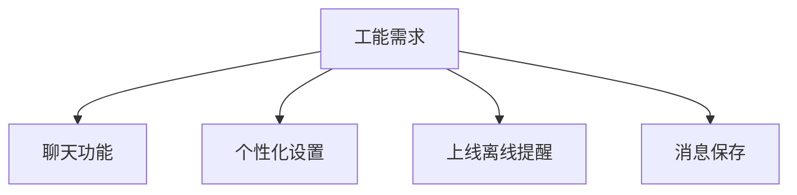
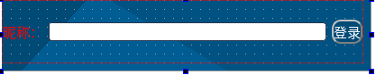
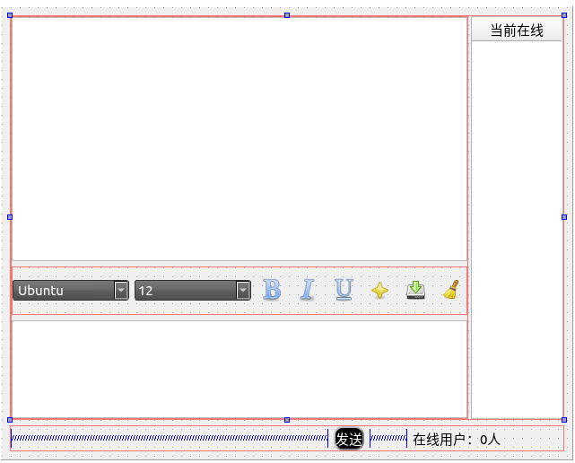
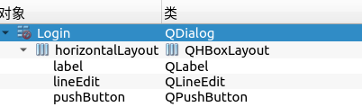
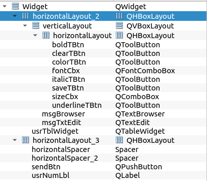
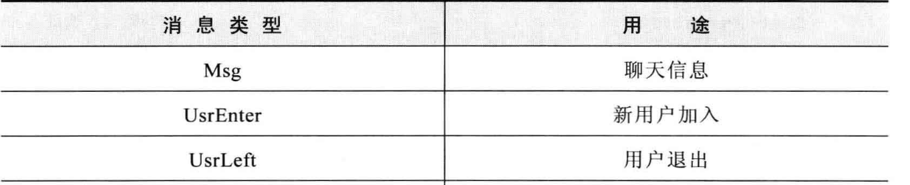
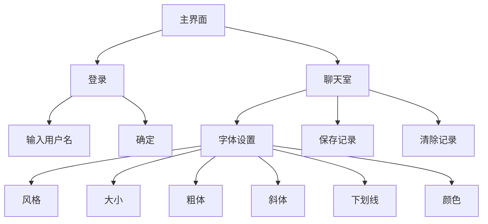
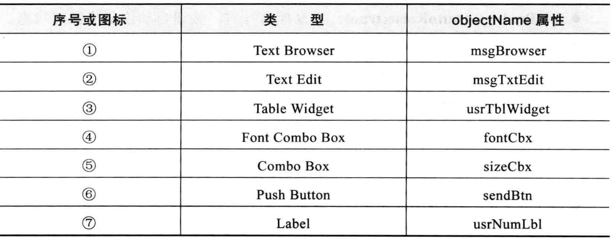
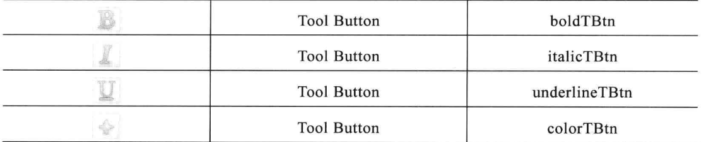
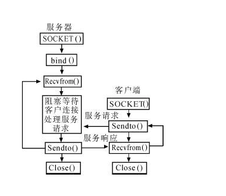

# 1. 功能需求分析	
1）功能需求分析
 功能需求分析如图1-1所示。

 - *图1-1*

2）聊天功能：用户可以通过该软件和局域网下同软件用户进行匿名聊天，而且可以使用图片进行聊天（发表情）。
3）上线提醒：用户可以使接受到其他用户的上、下线的提醒。
4）个性设置：用户可以设置自己喜欢的字体，字号的，颜色等。
5）消息保存：用户可以保存聊天的内容。
# 2. 总体设计	
总体设计方案是将界面的设计和功能的实现分开，界面主要使用Qtdesinger进行设计。功能主要使用UDP进行通信，使用P2P的设计架构。即每个客户端，既是客户端有是服务端。
**主界面：**
- *图2-1*登录界面

- *图2-2聊天界面*

**布局：**
- *图2-3聊天界面*

*图2-4聊天界面*


## 2.1 功能模块	

**聊天框字体的设计:**
***
本程序在聊天过程中用户可以设置自己喜欢的字体颜色大小等属性。它的主要实现方式是使用 TextEdit的currentCharchanged（QTextCharFormat）信号,连接槽函数curFmtChanged(const QTextCharFormat)对界面上的发送区域文本框msgTextEdit进行字体格式的设置;

当发送时，获取当前区域的html字符，将字符发送出去，在显示区域显示html格式的文本，这样就使得接收端也能已发送用户设置的格式。


**实现方式：**

在聊天窗口的构造函数中将信号和槽关联，然后实现槽函数，槽函数实现如下
```cpp
void Widget::curFmtChanged(const QTextCharFormat &fmt)
{
    ui->fontCbx->setCurrentFont(fmt.font());

    if (fmt.fontPointSize() < 8) {
        ui->sizeCbx->setCurrentIndex(4);
    } else {
        ui->sizeCbx->setCurrentIndex(ui->sizeCbx->findText(QString::number(fmt.fontPointSize())));
    }
    ui->boldTBtn->setChecked(fmt.font().bold());
    ui->italicTBtn->setChecked(fmt.font().italic());
    ui->underlineTBtn->setChecked(fmt.font().underline());
    color = fmt.foreground().color();
}
```
在发送时将文本区域转成html,在接受时显示html,这样就保证了字体的格式，它的实现代码如下。

```cpp
QString Widget::getMsg()
{
    QString msg = ui->msgTxtEdit->toHtml();

    ui->msgTxtEdit->clear();
    ui->msgTxtEdit->setFocus();
    return msg;
}
```

**UPD的消息传递实现：**
***
UDP是一种不可靠的传输协议，它在传输过程中不要要保持连接。UDP报文没有可靠性保证、顺序保证和流量控制字段等，可靠性较差。但是正因为UDP协议的控制选项较少，在数据传输过程中延迟小、数据传输效率高，适合对可靠性要求不高的应用程序。在Qt中使用UDP服务很简单，只需要在。pro文件加入`QT       += network`


在这个聊天室程序中对消息类型进行了分类，它包括Msg, UsrEnter, UsrLeft这三种类型，分别代表了 消息、用户登录、用户离开。


**拖拽事件的响应:**
***
在这个软件中可以拖拽来发送图片，它的实现是重写了窗口的 `void dragEnterEvent(QDragEnterEvent *event);void dropEvent(QDropEvent *event);`在void dragEnterEvent(QDragEnterEvent *event);方法中判断当前文件是否为图片，如果是就接收拖拽，否者窗口不接受。在void dropEvent(QDropEvent *event);方法中获取MiMEDATA提取源数据中的图片，显示到编辑框。
**流程图：**
```flow
str=>start: 开始
en=>end: 结束

cond=>condition: 是图片？
op=>operation: 设置窗口接收拖放
op1=>operation: 窗口忽略这个文件
op2=>operation: 显示到发送框

str->cond
cond(yes)->op->op2->en
cond(no)->op1->op2
```

## 2.2总体设计层次
系统总体设计层次图如图2-1所示。
- *图2-1层次设计*


# 3. 详细设计
本软件的界面设计主要是由Qt的界面设计器实现，在本部分主要叙述功能的实现。界面的实现可以参考在2.1的叙述。
## 3.1基本界面设置
界面中所有道的变量及其属性
- *表3-1相关变量*



## 3.2登录的实现
登录界面的实现过程见2.1，登录界面的实现起来非常简单只需要在当前界面new一个聊天窗口就可以了，在这里需要把用户的昵称作为参数传过去。
- 表3-2登录界面的变量

|变量|作用|
|--|--|
|QString userName;|用户昵称|
|Widget *chatWidget;|聊天窗口对象|
它的实现见下面的代码：
```cpp
void Login::on_pushButton_clicked()
{
    userName=ui->lineEdit->text();
    if (userName == "") {
        QMessageBox::warning(0,tr("警告"),tr("昵称不能为空"),QMessageBox::Ok);
        return;
    }
    chatWidget=new Widget(0,userName);
    chatWidget->setAttribute(Qt::WA_DeleteOnClose);

    chatWidget->show();

    this->close();
}
```
## 3.3消息传递的实现
发送消息使用的是UPD传输协议，它使用到的变量有如表3-3
- 表3-3消息传递的相关变量/方法

|变量/方法|作用|
|--|--|
|enum MsgType{Msg, UsrEnter, UsrLeft};|消息的类型
|QUdpSocket *udpSocket;|udp对象|
|QString getUsr();|获取用户名|
|  QString getMsg();|获取消息|
|void usrEnter(QString usrname,QString ipaddr="");|用户登录响应函数|
 |   void usrLeft(QString usrname,QString time);|用户离开响应函数
  |  void sndMsg(MsgType type);|发送消息函数|

它的实现方式已经在2.1中叙述过了，在这里给出具体的实现代码：
**发送、接收的实现方式：**
使用一个switch结构来判断发送的数据类型，将根据不同的数据类型做出不同的反应，最后将数据报发出
```cpp
void Widget::sndMsg(MsgType type)
{
    QByteArray data;
    QDataStream out(&data, QIODevice::WriteOnly);
    QString address = getIP();
    out << type << getUsr();
    switch(type)
    {
    case Msg :
        if (ui->msgTxtEdit->toPlainText() == "") {
            QMessageBox::warning(0,tr("警告"),tr("发送内容不能为空"),QMessageBox::Ok);
            return;
        }
        out << address << getMsg();
        ui->msgBrowser->verticalScrollBar()->setValue(ui->msgBrowser->verticalScrollBar()->maximum());//?
        break;

    case UsrEnter :
        out << address;
        break;

    case UsrLeft :
        break;

    }
    udpSocket->writeDatagram(data,data.length(),QHostAddress::Broadcast, port);
}
```
使用一个switch结构来判断接收的数据类型，将根据不同的数据类型做出不同的反应

```cpp
void Widget::processPendingDatagrams()
{
    while(udpSocket->hasPendingDatagrams())
    {
        QByteArray datagram;
        datagram.resize(udpSocket->pendingDatagramSize());
        udpSocket->readDatagram(datagram.data(), datagram.size());
        QDataStream in(&datagram, QIODevice::ReadOnly);
        int msgType;
        in >> msgType;
        QString usrName,ipAddr,msg;
        QByteArray line,str;
        QString time = QDateTime::currentDateTime().toString("yyyy-MM-dd hh:mm:ss");

        switch(msgType)
        {

        case Msg:
            in >> usrName >> ipAddr >> msg;
            ui->msgBrowser->setTextColor(Qt::blue);
            ui->msgBrowser->setCurrentFont(QFont("Times New Roman",12));
            ui->msgBrowser->append("[ " +usrName+" ] "+ time);
            ui->msgBrowser->append(msg);
            break;

        case UsrEnter:
            in >>usrName >>ipAddr;
            usrEnter(usrName,ipAddr);
            break;

        case UsrLeft:
            in >>usrName;
            usrLeft(usrName,time);
            break;
        }
    }

}
```

## 3.4拖拽图片的实现
在2.1中我们已经知道图片拖拽实现方式非常简单，只需要重写两个函数，它的具体代码如下
**代码实现：**
```cpp

void Widget::dragEnterEvent(QDragEnterEvent *event)
{
    if(!event->mimeData()->urls()[0].toLocalFile().right(3).compare("jpg",Qt::CaseInsensitive)
            ||!event->mimeData()->urls()[0].toLocalFile().right(3).compare("png",Qt::CaseInsensitive)
            ||!event->mimeData()->urls()[0].toLocalFile().right(3).compare("bmp",Qt::CaseInsensitive)
            ||!event->mimeData()->urls()[0].toLocalFile().right(4).compare("jpeg",Qt::CaseInsensitive))
        {
            event->acceptProposedAction();//接受鼠标拖入事件
        }
        else
        {
            event->ignore();//否则不接受鼠标事件
        }


}
void Widget::dropEvent(QDropEvent *event)
{
       //获得图片
      const QMimeData *mineData=event->mimeData();//获取MIMEData
      if(mineData->hasUrls())
      {
          QList<QUrl>urlList=mineData->urls();    //获取URL列表
          if(urlList.isEmpty())return ;
          fileName=urlList.at(0).toLocalFile();
          if(fileName.isEmpty())return;


       QImage img(mineData->urls()[0].toLocalFile());
       image=img;
           QTextDocument * textDocument = ui->msgTxtEdit->document();
           textDocument->addResource( QTextDocument::ImageResource, urlList.at(0), QVariant ( image ) );
           QTextCursor cursor = ui->msgTxtEdit->textCursor();
           QTextImageFormat imageFormat;
           imageFormat.setWidth( image.width()/2 );
           imageFormat.setHeight( image.height()/2 );
           imageFormat.setName( urlList.at(0).toString() );
           cursor.insertImage(imageFormat);

    }
```
## 3.5字体设置的实现
字体设置的过程也非常简单，在2.1中也有交代过，因为每个大多数功能类似，在这里仅给出加粗字体的实现方式。这个函数会触发currentCharFormatChanged(QTextCharFormat))信号从而改变字体的样式。
```cpp
void Widget::on_boldTBtn_clicked(bool checked)
{
    if(checked)
        ui->msgTxtEdit->setFontWeight(QFont::Bold);
    else
        ui->msgTxtEdit->setFontWeight(QFont::Normal);
    ui->msgTxtEdit->setFocus();
}
```
# 4. 设计与实现	
## 4.1 实现方法简介
目前大多数聊天室都是基于C/S架构，这种方式需要一个服务器来进行转发，对于局域网用户来说并不是很方便，因为这需要一台电脑作为服务端24h待机。本软件使用P2P架构，无需服务器。而且相对于TCP实现这种方式所占资源更小，UDP的广播服务也可以很好的用于局域网的消息传递。而且在本软件中不会给用户显示在线用户的IP更加保护了用户的隐私，更符合匿名聊天室的要求。socket是在应用层和传输层之间的一个抽象层，它把TCP/IP层复杂的操作抽象为几个简单的接口供应用层调用以实现进程在网络中通信，socket是一种”打开—读/写—关闭”模式的实现，服务器和客户端各自维护一个”文件”，在建立连接打开后，可以向自己文件写入内容供对方读取或者读取对方内容，通讯结束时关闭文件；
## 4.2 主要原理及关键代码
UDP通信流程如下图4-1：
- 4-2UDP通信流程



首先要在构造函数中设置new一个Socket udp 的对象，然后为`readyRead()`信号板绑定    `processPendingDatagrams()` 槽函数。具体的的功能实现见 **3.3消息传递的实现**


#  5. 总 结	
Socket编程的内容包含许多计算机网络的知识，以前从来没有使用过，在这一次实际的运用中也遇到了些问题，但同时也提高了我的能力。比如测试UDP在传输大文件时如果部分包，会发生错误，解决方法是将文件每次读一定量发送，最后约定一个结束标志，将文件分批发送。

调试中遇到一个印象很深的问题，就是断点无法被触发，接近花了一个下午，才发下原来是忘记关联槽函数了，这反应出在编程过程中细节真的很重要。

由于时间和能力的限制，程序的界面并不是很完美，Qt的界面美化可以使用CSS,这是一个很强大的功能，随着知识和经验的增加，这些问题都将被解决。


